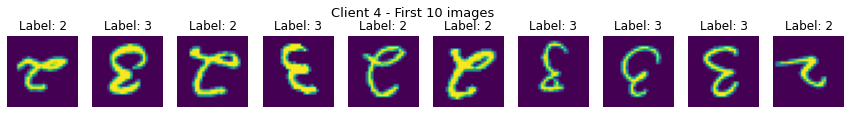
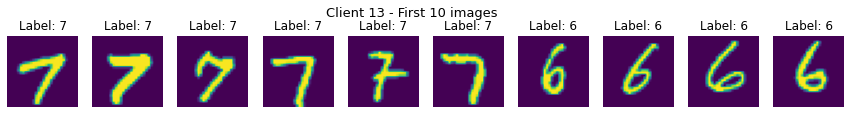

# Label-shift rotated dataset

生成non-iid mnist和cifar10数据集，用于个性化联邦学习和聚类联邦学习。

Generate non-IID mnist and cifar10 datasets for personalized federated learning and clustered federated learning.

### 运行 run
运行`python generate_dataset.py`以下载和生成数据集，示例代码和部分数据集图片展示在`plot.ipynb`中。

Run `python generate_dataset.py` to download and generate the dataset. 
Sample code and some dataset images are shown in `plot.ipynb`.

### 数据分布 client data distribution (label)
client 0: [0, 1]

client 1: [0, 1]

client 2: [0, 1]

client 3: [0, 1]

client 4: [2, 3]

client 5: [2, 3]

client 6: [2, 3]

client 7: [2, 3]

client 8: [4, 5]

client 9: [4, 5]

client 10: [4, 5]

client 11: [4, 5]

client 12: [6, 7]

client 13: [6, 7]

client 14: [6, 7]

client 15: [6, 7]

client 16: [8, 9]

client 17: [8, 9]

client 18: [8, 9]

client 19: [8, 9]

若`client_id % 2 == 0`则该客户端的数据集中图片旋转180度。

If `client_id % 2 == 0`, the picture in the client's data set is rotated 180 degrees.

